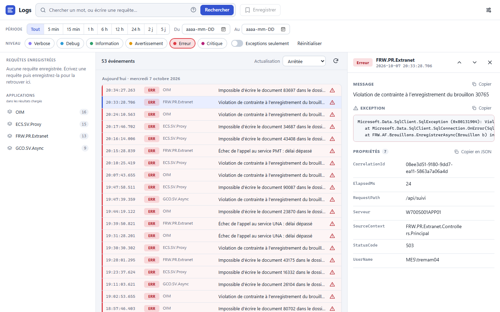
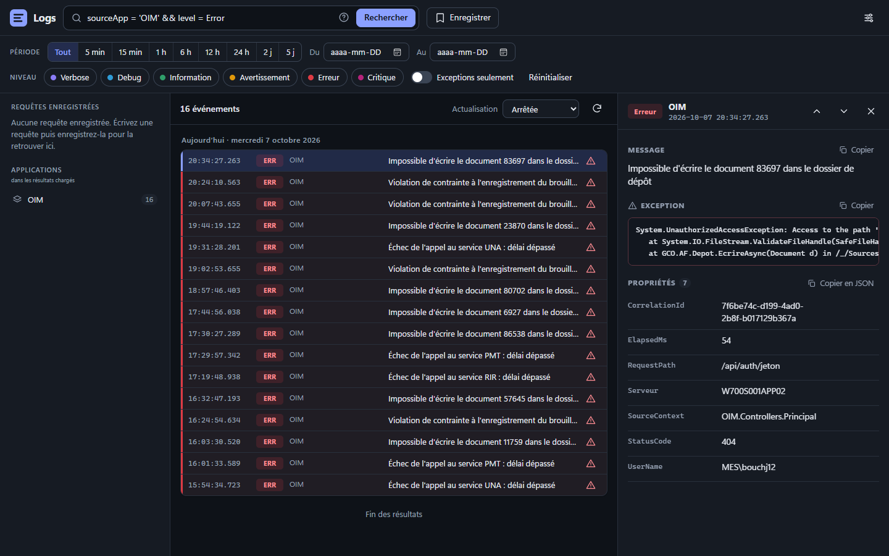

# SejilSQL

SejilSQL collects the logs of your ASP.NET Core applications in **SQL Server** and lets you browse, search and filter them in a web viewer served by the application itself. It reads the events sent by [Serilog](https://serilog.net) (`Serilog.Sinks.Http`), keeps their properties, and can centralize the logs of many applications in one place.

It is a fork of [Sejil](https://github.com/alaatm/Sejil) by Alaa Masoud (SQLite, abandoned since 2021), rebuilt for SQL Server and .NET 10.



## Features

- **A modern viewer** (Vue 3, one 115 KB file): light and dark themes, French and English, infinite scroll, automatic refresh, a detail panel with the message, the exception and every property, keyboard shortcuts (`/` to search, arrows to browse, `Esc` to close) and addresses you can share (the filters are in the `#` part).
- **A query language**: a word to look for, or conditions such as `UserName = 'bob' && level = Error`, `RequestPath like '%forms%'`, `sourceApp = 'OIM' or sourceApp = 'ECS'`. One click on a property of an event filters on its value. Queries can be saved and shared.
- **Filters** by period, date range, level and "events with an exception".
- **Collects the logs of other applications** (`POST /log`), writes them in one round trip, and deletes the old ones.
- **A minimum log level shared by the applications**, changed from the viewer.



## Getting started

1. Create the tables once, on the database of your choice: run [db.sql](./src/Sejil.Server/db.sql). It is idempotent and creates the `[Journal]` schema with `log`, `log_property`, `log_query` and `log_config`.

2. Install the package:

   ```powershell
   dotnet add package SejilSQL
   ```

3. Add SejilSQL to the application (**Program.cs**):

   ```csharp
   using SejilSQL;
   using SejilSQL.Configuration;
   using Serilog.Events;

   var builder = WebApplication.CreateBuilder(args);

   builder.WebHost.AddSejil(new SejilSettings("/logs", LogEventLevel.Warning)
   {
       ConnectionString = builder.Configuration.GetConnectionString("Journal"),
       Title = "Logs",
       LogRetentionDays = 30,                   // events older than this are deleted
       // LevelId = "MyApp",                    // keep the minimum level in the database (see below)
       // AuthenticationScheme = "Negotiate",   // require authentication to view the logs
   });
   builder.Services.AddSejilServices();         // receives the logs and deletes the old ones

   var app = builder.Build();
   // app.UseAuthentication();                  // before UseSejil when AuthenticationScheme is set
   app.UseSejil();
   app.Run();
   ```

4. Open **https://your-app/logs**.

The viewer needs SQL Server 2012 or later (`OFFSET`/`FETCH`). Events are written in a single statement with `OPENJSON` on compatibility level 130 (SQL Server 2016) or higher; below that, they are written row by row in one transaction.

## Receiving the logs of other applications

With `AddSejilServices()`, the site answers `POST /log?sourceApp=<name>` with the batches sent by [Serilog.Sinks.Http](https://github.com/FantasticFiasco/serilog-sinks-http) (a JSON array, its default format):

```csharp
// in the sending application
.WriteTo.Http(requestUri: "https://logs-site/log?sourceApp=MyApp", queueLimitBytes: 1_048_576)
```

- The route is anonymous (the senders have no identity to present). Change it with `IngestPath` on the settings, or set it to `null` to turn it off.
- Timestamps sent in UTC are stored in local time, like the date filters and the cleanup.
- A batch is written atomically, in a single round trip (1000 events with 10 properties each take about half a second over the network, against minutes one row at a time). When it cannot be written the answer is `503`, so the sender keeps the batch and retries without creating duplicates.
- Property values are stored as text exactly as the sender wrote them, whatever the culture of the server: `12.5`, `true`, `2026-10-07T21:48:00Z`; an object as its JSON text; a JSON `null` as `NULL`.

## Shared minimum log level

Set `LevelId` on the settings to keep the minimum log level in `[Journal].log_config` instead of in memory. `GET {Url}/min-log-level` then returns `{"minimumLogLevel":"Warning"}` for that identifier, and the level chosen in the viewer is saved under it. Applications read it periodically and apply it to a `LoggingLevelSwitch`. These two routes are anonymous. If `Url` is behind authentication, expose them elsewhere with `LevelPath` (GET and POST).

## Writing a query

| Query | Meaning |
|---|---|
| `connexion refusée` | the word, in the message, the exception or any property |
| `UserName = bob` | a property equal to a value (`=`, `!=`, `like`, `not like`) |
| `RequestPath like '%forms%'` | `%` stands for any characters |
| `level = Error` | the level, by name (`Verbose`, `Debug`, `Information`, `Warning`, `Error`, `Fatal`, also `Critical` and `Trace`) or by number |
| `sourceApp = 'OIM' and message like '%timeout%'` | columns: `message`, `level`, `timestamp`, `exception`, `sourceApp`. Combine with `&&`/`and`, `\|\|`/`or` and parentheses |

## Upgrading

### From 2.x to 3.x

3.x targets **.NET 10** only (`net10.0`, using the ASP.NET Core shared framework instead of the 2.2 packages) and no longer depends on Newtonsoft.Json.

- **Property values are stored exactly as the sender wrote them**, whatever the culture of the server: `12.5` (not `12,5`), `true` (not `True`), `2026-10-07T21:48:00Z` (not `2026-10-07 21:48:00`), an object as its JSON text, and a JSON `null` as `NULL`. Rows written by 2.x keep their old text, so a search on a decimal or a date will not match both.
- `Event.Properties` is now `IDictionary<string, string>` (it was an `ExpandoObject`), `Renderings` and the types around it are gone, and `SejilService.TryEmitBatchAsync` is new. If you receive the logs yourself (a page or controller calling `EmitBatchAsync`), remove it: call `services.AddSejilServices()` and let `POST /log` do it.
- `ISejilController.SetMinimumLogLevel` became `SetMinimumLogLevelAsync`, and `ISejilSettings` gained `IngestPath`, `LevelId` and `LevelPath` (default interface members, nothing to implement).
- Run [db.sql](./src/Sejil.Server/db.sql) again: it adds `[Journal].log_config`.

### What 3.1 fixes

- **Paging works again**: since the move to SQL Server, page 2 returned the events of page 1, so scrolling never loaded anything new. Pages are now skipped with `OFFSET`/`FETCH` over a total order (`timestamp`, `id`).
- **Searching a word that contains `or`, `and` or `like` works**: the query parser split on those letters even inside a word, so searching `formulaire` found every event containing an `f`. They are now whole words, in any case.
- **The first page no longer waits 25 seconds on a busy server**: the query sorted the joined rows by property name, and since message and exception are `nvarchar(max)` that sort asks SQL Server for a large memory grant, which a shared server can take 25 seconds to give. The page is now read in order with no sort, and the properties of an event are sorted by name in code.
- **A query can name the level**: `level = Error`, `level != Debug`, as well as `level = 4`. It used to fail, because the column holds a number.
- The `Verbose` level filter no longer sends an unknown name, and the last day of a date range is included.
- A new viewer (see above), built from `src/Sejil.Client`.

## Building

You need the .NET 10 SDK (and Node.js 22 or later to rebuild the viewer):

```powershell
git clone https://github.com/MTESSDev/SejilSQL.git
cd SejilSQL
dotnet build
dotnet test
dotnet pack ./src/Sejil.Server -c Release
```

The viewer is a Vue 3 application in `src/Sejil.Client`. `npm run embed` builds it into a single `index.html` and copies it to `src/Sejil.Server/index.html`, where it is embedded in `SejilSQL.dll`. `npm run dev` serves it with hot reload and forwards its calls to a site that hosts SejilSQL (`SEJIL_URL`, for example the sample app).

Run the sample app:

```powershell
cd ./sample/SampleBasic
dotnet run
```

## License

[](https://opensource.org/licenses/Apache-2.0)

Copyright &copy; Alaa Masoud, Dany Côté.

This project is a fork of [Sejil](https://github.com/alaatm/Sejil), provided as-is under the Apache 2.0 license. For more information see the [LICENSE file](./LICENSE).
